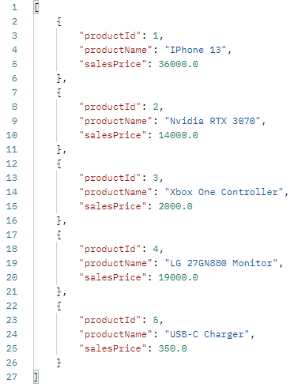
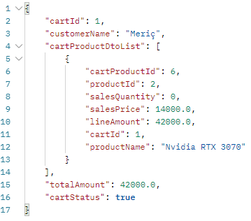
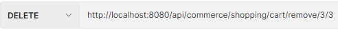

# Fibabanka Bootcamp Project

A Spring Boot backend project with layered architecure and microservices.
By Buğra Meriç Değirmenci

## Project Architecture

The project architecture consists of 3 individual projects:

- Commerce (Main Application)
- Inventory
- Shopping

### Commerce Microservice Application (Main Application)

The commerce application runs on port 8080 and it is the main application of this project. It is layered as; Controller,Service and Components. An API call made by a user is handled through the controller which calls the necessary service. After, a component is called to send an API request to the according microservice.

The Commerce Application communicates with both of the microservices to gather or send necessary information. Some DTOs which needs information from both of the microservices are created in this application at runtime.
For example: the CartDTO includes cart information from the shopping service and the product information such as the products name and price from the inventory microservice. Which are later combined in a DTO.

#### Commerce Application APIs

- Show Categories : `GET api/commerce/inventory/categories`
- Show Product : `GET api/commerce/inventory/products/{id}`
- Show Products by Category : `GET api/commerce/inventory/products/{categoryId}`
- Create Cart : `GET api/commerce/shopping/cart/create`
- Add product to Cart : `POST api/commerce/shopping/cart/add`
- Delete product from Cart : `DELETE api/commerce/shopping/cart/remove/{cartId}/{productId}`
- Checkout Cart : `PUT api/commerce/shopping/checkout/{cartId}`
- Show Cart Information : `GET api/commerce/shopping/cart/find/{cartId}`

### Inventory Microservice

The inventory microservice project runs on port 8081 and it is layered as; Resource Controller, Service and Repository layers. The inventory controller responds to the API call by calling the corresponding service which later calls the repository. After that, the repository executes the necessary operations on the PostgreSQL database.

The main purpose of this microservice is the retrieve and send data about products and categories.

#### Inventory Microservice APIs

- Show Categories : `GET /inventory/categories`
- Show Product : `GET /inventory/products/{id}`
- Show Products by Category : `GET /inventory/products/{categoryId}`

#### Inventory Entites

- ##### Category

  long : categoryId
  String : categoryName

- ##### Product

  long : productId
  String : productName
  double : salesPrice
  long : categoryId from Category

### Shopping Microservice

The shopping microservice project runs on port 8082 and it is layered as; Resource Controller, Service and Repository layers. The shopping controller responds to the API call by calling the corresponding service which later calls the repository. After that, the repository executes the necessary operations on the PostgreSQL database.

The main purpose of this microservice is to retrieve and send data about carts and cart-product information.

#### Shopping Microservice APIs

- Create Cart : `GET /shopping/cart/create`
- Add product to Cart : `POST /shopping/cart/add`
- Delete product from Cart : `DELETE api/shopping/cart/remove/{cartId}/{productId}`
- Checkout Cart : `PUT /shopping/checkout/{cartId}`
- Show Cart Information : `GET /shopping/cart/find/{cartId}`

#### Shopping Entites

- ##### Cart

  long : cartId
  String : customerName
  double :totalAmount
  boolean : cartStatus

- ##### CartProduct

  long : cartProductId
  long : cartId from Cart
  long : productId
  long : salesQuantity
  double : salesPrice
  double : lineAmount

## Project Testing

### Initial Database Entities

Below are the screenshots of various tables from the two databases.

##### Category Table

##### Product Table

##### Cart Table

##### CartProduct Table

### API Tests

Below are the screenshots of testing the project's various APIs with Postman.

#### Show Categories

##### Request

##### Response

#### Show Product

##### Request

##### Response

#### Show Products by Category

##### Request

##### Response

#### Create Cart

##### Request

Returns the id of the newly created cart.

##### Response

##### Change in Database

A new cart with the id 5 is added to the database. Customer name is null at initialization, accoring to the project's requirements.

#### Add Product to Cart

##### Request

Adds a product to a cart. Later gathers the product's price from the inventory api and calculates the line price. (product.salesPrice \* salesQuantity) (14000 \* 3)

##### Response

##### Change in Database

A new cart product is added to the database with the id of 6. As can be seen, the line amount is calculated correctly and the salesPrice is gathered from the inventory api.

As can be seen, the total_amount of the cart with the id of 1 changed from 0 to 42000.

#### Show Cart Information

Shows all of the cart's information. The displayed CartDto is combined at runtime to gather the product name and other information from the inventory api together with the other information from the shopping api.

##### Request

##### Response

The cartDto is displayed with the array of cartProductDto list which includes the products added to the cart.

#### Delete Product from Cart

Deletes a product from a cart.

##### Request

##### Response

##### Change in Database

As can be seen, the cartProduct with the id of 3 is removed from the cart with the id of 3.

#### Checkout Cart

Sets the corresponding cart's status from false to true.

##### Request

##### Response

##### Change in Database

As can be seen, the cart_status of the cart with the id of 1 changed from false to true.

